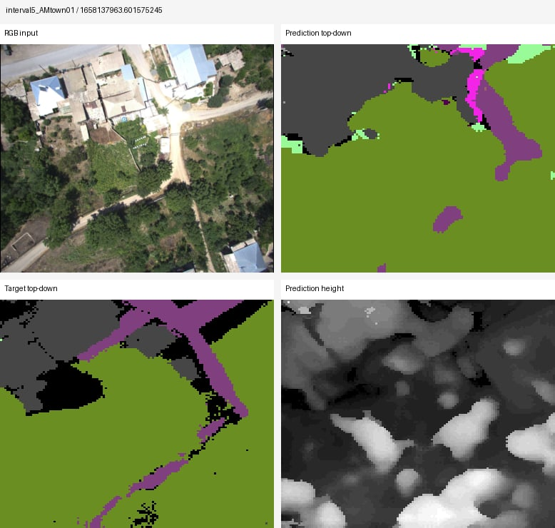

# UAVScenes SSC project

**Start here:** read `MASTER_INSTRUCTIONS.md`. The primary workflow is now **interval5** because it is faster, smaller, and better for debugging the SSC benchmark construction. Interval1 remains supported as an optional full-rate expansion.

Main commands:

```bash
bash scripts/setup_env.sh
export UAVSSC_DATA_ROOT=$PWD/data/raw/uavscenes_official
bash scripts/run_preprocess_interval5.sh
```

Key generated outputs:

```text
data/index/manifest_interval5.parquet
data/processed/interval5/rgb_ssc_npz/
data/processed/interval5/lidar_ssc_npz/
data/processed/interval5/fusion_ssc_npz/
data/processed/interval5/rgb_overlays/
data/processed/interval5/fusion_overlays/
```

For the previous full-rate workflow, see `MASTER_INSTRUCTIONS_INTERVAL1.md` and run `bash scripts/run_preprocess_interval1.sh`.


## RTX 4090 / full-resolution image OOM fix

Original UAVScenes images are about `2048 x 2448`. Do not feed those directly to MonoScene. Use the safe launcher:

```bash
bash scripts/train_rgb_monoscene_interval5_4090.sh
```

This resizes RGB input to `640 x 768` online and rescales `projected_pix_*`, so existing interval5 RGB `.npz` files do not need to be rebuilt.

Optional: regenerate RGB/fusion `.npz` files with resized projection metadata only:

```bash
bash scripts/reexport_interval5_resized_rgb_npz.sh
```

You do not need to rerun manifest building, LiDAR/global semantic fusion, or scene voxel map creation for this OOM fix.


## MonoScene B0 evaluation and visualization

After training the lightweight MonoScene B0 adapter, evaluate with:

```bash
cd /root/Tuan/uavssc_project
EVAL_CHECKPOINT=/absolute/path/to/checkpoint.ckpt \
  bash scripts/eval_rgb_monoscene_interval5_4090_b0.sh
```

Generate qualitative prediction panels with:

```bash
cd /root/Tuan/uavssc_project
EVAL_CHECKPOINT=/absolute/path/to/checkpoint.ckpt \
MAX_PREDICT_SAMPLES=50 \
  bash scripts/visualize_rgb_monoscene_interval5_4090_b0.sh
```

Evaluation and visualization now use the same configurable settings as training: `rgb_backbone`, `feature`, `input_image_hw`, `context_prior`, `relation_loss`, `fp_loss`, and `project_1_*`. Keep these consistent with the checkpoint you trained.

---

## Current stabilized workflow note

This package has been refreshed with the latest interval5, MonoScene, VoxFormer-style, LiDAR-only, and RGB+LiDAR fusion fixes. See [`PROJECT_UPDATE_SUMMARY_FINAL.md`](PROJECT_UPDATE_SUMMARY_FINAL.md) for the exact commands and what changed.

Recommended current baseline order:

1. RGB-only MonoScene B0/F64, using `scripts/train_rgb_monoscene_interval5_4090_b0.sh`.
2. RGB-only VoxFormer-style, using `scripts/train_rgb_voxformer_interval5_4090.sh`.
3. LiDAR-only LMSCNet-style, only after a 200-sample export smoke test.
4. RGB+LiDAR fusion, only if the fusion export smoke test is affordable.

Do not train MonoScene full-resolution UAV images or EfficientNet-B7 on a 24GB RTX 4090. Use the stable defaults in the launcher scripts unless deliberately testing a new setting.
